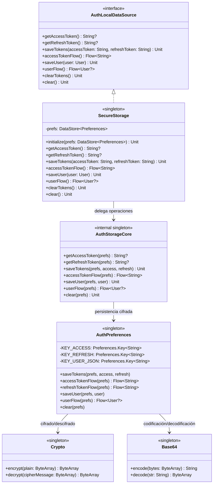
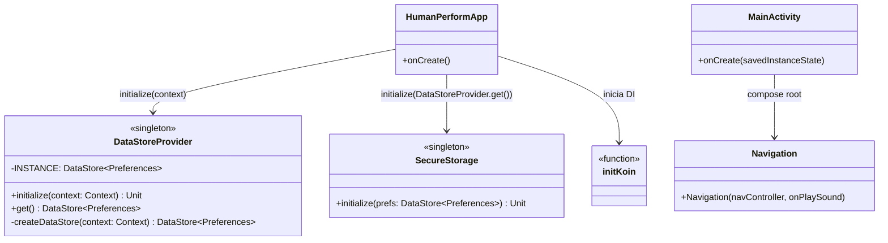
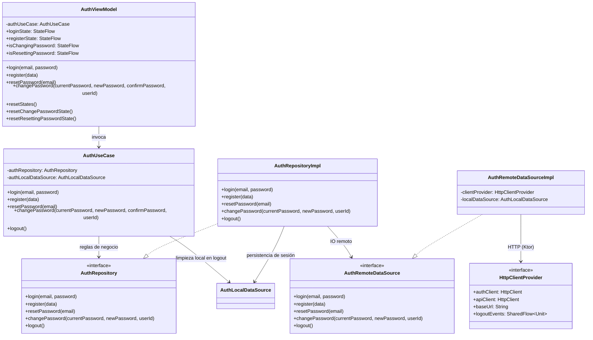
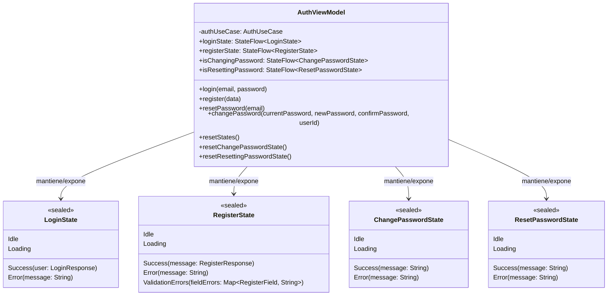

# Arquitectura del Módulo de Autenticación (actualizada)

> Esta documentación reemplaza supuestos legacy (como `ApiClient/AuthApiService` o inicialización de `SecureStorage` en `MainActivity`) por la implementación real actual del proyecto.

## 1. Facade de almacenamiento local — `SecureStorage` + `AuthStorageCore` + `AuthPreferences`

---

## 2. Módulo Android App — inicialización real y navegación

**Nota:** Actualmente `MainActivity` **no** inicializa `DataStoreProvider` ni `SecureStorage`; esa responsabilidad está centralizada en `HumanPerformApp.onCreate()`.

---

## 3. Flujo Auth KMM — `ViewModel` → `UseCase` → `Repository` → `Remote/Local`

---

## 4. `AuthViewModel` y UI States

