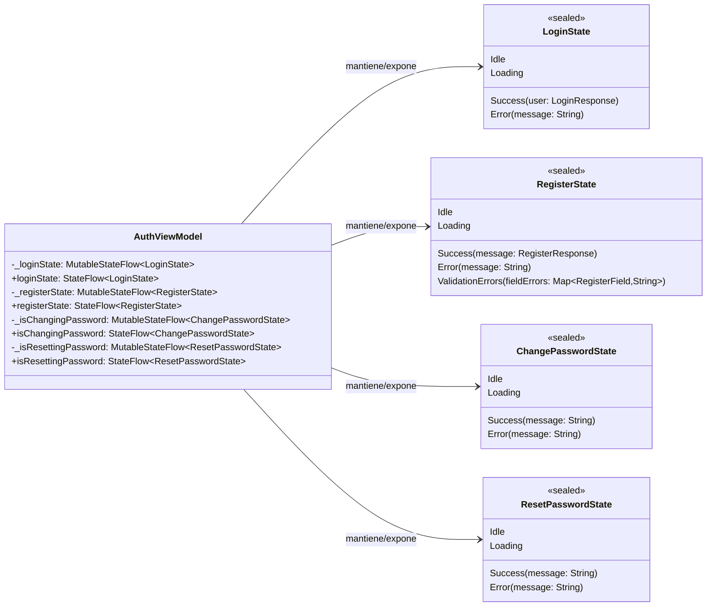

# Diagrama de clases: dependencia de `AuthViewModel` con estados de UI

Este diagrama muestra **solo** la relación entre `AuthViewModel` y las clases de estado de UI que expone mediante `StateFlow`.

