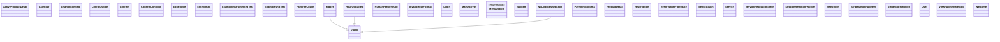

# Diagramas de clases (Mermaid)

## shared

```mermaid
classDiagram
    class ActionUiState
    class ActiveProductDetailState
    class AddPaymentMethodSheetData
    class AddPaymentMethodUiState
    class AndroidSessionNotificationManager
    class ApiClient
    class AssignEvent
    class AssignPreferredCoachRequest
    class AssignPreferredCoachResponse
    class AssignProductRequest
    class AssignProductResponse
    class AssociatedObject
    class AuthPreferences
    class AuthRepository
    <<interface>> AuthRepository
    class AuthRepositoryImpl
    class AuthUseCase
    class AuthViewModel
    class Base64
    class BillingPrefill
    class BookingDomainException
    class BookingEvent
    class BookingRequest
    class Canceled
    class ChangePasswordException
    class ChangePasswordRequest
    class ChangePasswordState
    class CoachState
    class Completed
    class ConfirmRequired
    class ContainsSpace
    class Coupon
    class CouponApplyRequest
    class CouponUiState
    class CreatePaymentIntentRequest
    class CreatePiDto
    class CreateRefundRequest
    class CreateStripeCustomerResponse
    class Crypto
    class CryptoException
    class Crypto_Pays
    class CurrentRequired
    class CustomerData
    class DailySessionsUiState
    class DataStoreProvider
    class DaySession
    class DaySessionRepository
    <<interface>> DaySessionRepository
    class DaySessionRepositoryImpl
    class DaySessionUseCase
    class DaySessionViewModel
    class DecryptionFailed
    class DeleteProfilePicRequest
    class DeleteProfilePicState
    class DeleteUserState
    class DuplicateBooking
    class EditValidationResult
    class Empty
    class EncryptedResult
    class EncryptionHandler
    class EphemeralKeyDto
    class EphemeralKeyUiState
    class Error
    class ErrorResponse
    class EwalletResponse
    class EwalletTransaction
    class EwalletUiState
    <<interface>> EwalletUiState
    class ExampleInstrumentedTest
    class ExampleUnitTest
    class Failed
    class FetchUserBookingsState
    <<interface>> FetchUserBookingsState
    class Field
    <<enumeration>> Field
    class GenericBookingFailure
    class GetPreferredCoachResponse
    class GetPreferredCoachState
    class IOSSessionNotificationManager
    class Idle
    class Loading
    class LoginResponse
    class LoginState
    class MarkFavoriteState
    class NewRequired
    class NoLowercase
    class NoNumber
    class NoUppercase
    class NotFound
    class NotMatching
    class PaymentMethodsUiState
    class PaymentState
    class PlatformBridge
    class ProcessedBooking
    class Processing
    class Product
    class ProductDetailResponse
    class ProductDetailUiState
    class ProductTypeFilter
    <<enumeration>> ProductTypeFilter
    class Professional
    class PublishableKeyResponse
    class Ready
    class RefreshResponse
    class RefundUiState
    class RegisterField
    <<enumeration>> RegisterField
    class RegisterRequest
    class RegisterResponse
    class RegisterState
    class RegisterValidationResult
    class RepoFailure
    class ReserveResponse
    class ReserveUpdateRequest
    class ReserveUpdateResponse
    class ResetPasswordRequest
    class ResetPasswordState
    class SameAsCurrent
    class SecureStorage
    class ServiceAvailable
    class ServiceProductRepository
    <<interface>> ServiceProductRepository
    class ServiceProductRepositoryImpl
    class ServiceProductUiState
    class ServiceProductUseCase
    class ServiceProductViewModel
    class ServiceUiModel
    class ServiceUiState
    class SessionNotificationManager
    <<interface>> SessionNotificationManager
    class SessionsRequestContext
    class SharedPaymentResult
    class SharedPool
    class SimpleResponse
    class SimpleService
    class StartStripeCheckoutState
    class StripeCardDetails
    class StripeCheckoutConfig
    class StripeEphemeralKeyResponse
    class StripePaymentIntentResponse
    class StripePaymentMethod
    class StripePaymentMethodsContainer
    class StripePaymentMethodsResponse
    class StripeRepository
    <<interface>> StripeRepository
    class StripeRepositoryImpl
    class StripeSetupConfigData
    class StripeSetupConfigResponse
    class StripeUseCase
    class StripeViewModel
    class SubscriptionDto
    class Success
    class TooShort
    class TotalSessionsLimitExceeded
    class TransactionDto
    class UnassignEvent
    class UpdateState
    class UploadResponse
    class UploadState
    class User
    class UserBooking
    class UserProductsUiState
    class UserRepository
    <<interface>> UserRepository
    class UserRepositoryImpl
    class UserStatistics
    class UserStatsState
    <<interface>> UserStatsState
    class UserStatsViewModel
    class UserUseCase
    class UserValidator
    class UserViewModel
    class ValidationErrors
    class WeeklyLimitExceeded
    class name
    AuthRepositoryImpl --|> AuthRepository
    Canceled --|> AddPaymentMethodUiState
    Canceled --|> SharedPaymentResult
    Canceled --|> StartStripeCheckoutState
    Completed --|> AddPaymentMethodUiState
    Completed --|> SharedPaymentResult
    Completed --|> StartStripeCheckoutState
    ConfirmRequired --|> ChangePasswordException
    ContainsSpace --|> ChangePasswordException
    CurrentRequired --|> ChangePasswordException
    DaySessionRepositoryImpl --|> DaySessionRepository
    DecryptionFailed --|> CryptoException
    DuplicateBooking --|> BookingDomainException
    Empty --|> PaymentMethodsUiState
    IOSSessionNotificationManager --|> SessionNotificationManager
    Idle --|> ActionUiState
    Idle --|> AddPaymentMethodUiState
    Idle --|> ChangePasswordState
    Idle --|> CoachState
    Idle --|> DailySessionsUiState
    Idle --|> DeleteProfilePicState
    Idle --|> DeleteUserState
    Idle --|> EphemeralKeyUiState
    Idle --|> GetPreferredCoachState
    Idle --|> LoginState
    Idle --|> MarkFavoriteState
    Idle --|> PaymentState
    Idle --|> ProductDetailUiState
    Idle --|> RefundUiState
    Idle --|> RegisterState
    Idle --|> ResetPasswordState
    Idle --|> StartStripeCheckoutState
    Idle --|> UpdateState
    Idle --|> UploadState
    Loading --|> ActionUiState
    Loading --|> ActiveProductDetailState
    Loading --|> AddPaymentMethodUiState
    Loading --|> ChangePasswordState
    Loading --|> CoachState
    Loading --|> DeleteProfilePicState
    Loading --|> DeleteUserState
    Loading --|> EphemeralKeyUiState
    Loading --|> EwalletUiState
    Loading --|> FetchUserBookingsState
    Loading --|> GetPreferredCoachState
    Loading --|> LoginState
    Loading --|> MarkFavoriteState
    Loading --|> PaymentMethodsUiState
    Loading --|> PaymentState
    Loading --|> ProductDetailUiState
    Loading --|> RefundUiState
    Loading --|> RegisterState
    Loading --|> ResetPasswordState
    Loading --|> ServiceProductUiState
    Loading --|> ServiceUiState
    Loading --|> StartStripeCheckoutState
    Loading --|> UpdateState
    Loading --|> UploadState
    Loading --|> UserProductsUiState
    Loading --|> UserStatsState
    NewRequired --|> ChangePasswordException
    NoLowercase --|> ChangePasswordException
    NoNumber --|> ChangePasswordException
    NoUppercase --|> ChangePasswordException
    NotMatching --|> ChangePasswordException
    Processing --|> StartStripeCheckoutState
    SameAsCurrent --|> ChangePasswordException
    ServiceProductRepositoryImpl --|> ServiceProductRepository
    StripeRepositoryImpl --|> StripeRepository
    Success --|> DeleteProfilePicState
    Success --|> DeleteUserState
    Success --|> EditValidationResult
    Success --|> RegisterValidationResult
    Success --|> UnassignEvent
    TooShort --|> ChangePasswordException
    TotalSessionsLimitExceeded --|> BookingDomainException
    UserRepositoryImpl --|> UserRepository
    WeeklyLimitExceeded --|> BookingDomainException
```

## androidApp

```mermaid
classDiagram
    class ActiveProductDetail
    class Calendar
    class ChangeExisting
    class Configuration
    class Confirm
    class ConfirmContinue
    class Dialog
    class EditProfile
    class EnterEmail
    class ExampleInstrumentedTest
    class ExampleUnitTest
    class FavoriteCoach
    class Hidden
    class HourOccupied
    class HumanPerformApp
    class InvalidHourFormat
    class Login
    class MainActivity
    class MenuOption
    <<enumeration>> MenuOption
    class NavItem
    class NoCoachesAvailable
    class PaymentSuccess
    class ProductDetail
    class Reservation
    class ReservationFlowState
    class SelectCoach
    class Service
    class ServiceResolutionError
    class SessionReminderWorker
    class SexOption
    class StripeSinglePayment
    class StripeSubscription
    class User
    class ViewPaymentMethod
    class Welcome
    Hidden --|> Dialog
    HourOccupied --|> Dialog
    NoCoachesAvailable --|> Dialog
```

## iosApp

```mermaid
classDiagram
    class AddCouponView
    class AppState
    class AuthFlow
    class BrandAvatar
    class CalendarView
    class CameraView
    class ChangePasswordView
    class ConfigurationView
    class ContentView
    class ContentView_Previews
    class Coordinator
    class CryptoCallbacks
    class DefaultChip
    class Delegate
    class DocumentPicker
    class DocumentView
    class EditProfileView
    class EditableUserProfileImageView
    class ElectronicWalletView
    class EmptyStateView
    class EnterEmailView
    class ErrorStateView
    class FavoritesView
    class FieldError
    class GradientPill
    class HireServicesView
    class ImagePicker
    class LoginView
    class MainTabs
    class MyProductsView
    class MyProfileView
    class NavBarLogo
    class PasswordResetInfoView
    class PaymentMethodCard
    class PaymentMethodsShimmerView
    class PaymentMethodsView
    class ProductRow
    class ProfileRow
    class RegisterFormData
    class RegisterView
    class RegisterView_Previews
    class Result
    class RootView
    class SecureFieldIcon
    class ServiceRow
    class ServicesView
    class SexOption
    class Shimmer
    class SplashView
    class StatCard
    class StatsView
    class TextFieldIcon
    class TxRow
    class UserProfileImageView
    class UserView
    class WelcomeView
    class iOSApp
```
