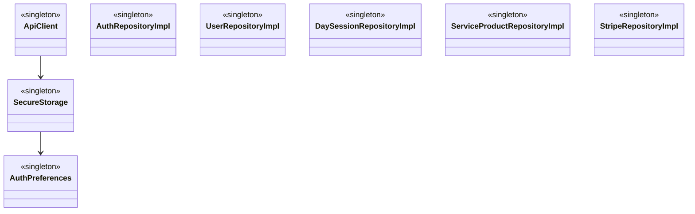
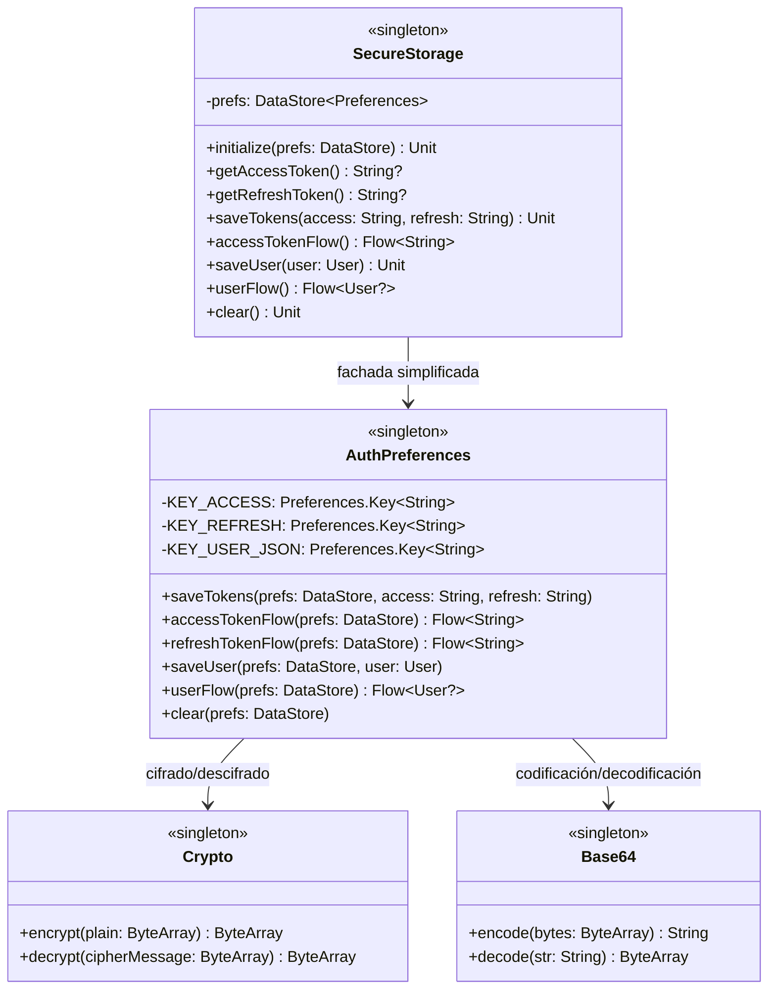
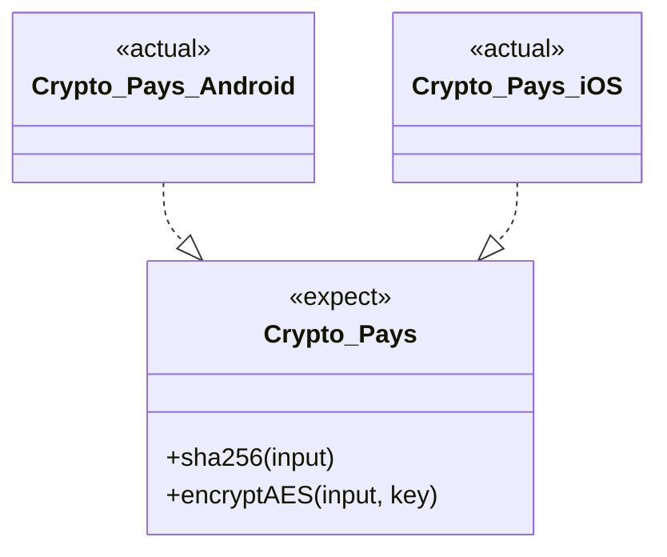
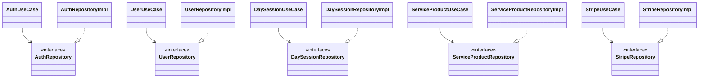
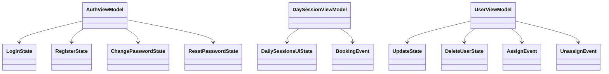

# Diagramas de clases (Mermaid)

Este documento reemplaza el volcado automático anterior por diagramas **arquitectónicos y de patrones** que reflejan la estructura real del proyecto KMM.

## 1) Arquitectura general KMM (capas)

```mermaid
classDiagram
    direction TB

    class AuthViewModel {
      -authUseCase: AuthUseCase
      +loginState: StateFlow~LoginState~
      +registerState: StateFlow~RegisterState~
      +isChangingPassword: StateFlow~ChangePasswordState~
      +isResettingPassword: StateFlow~ResetPasswordState~
      +login(email, password)
      +register(data)
      +resetPassword(email)
      +changePassword(currentPassword, newPassword, confirmPassword, userId)
      +resetStates()
      +resetChangePasswordState()
      +resetResettingPasswordState()
    }

    class UserViewModel {
      -userUseCase: UserUseCase
      +userState: StateFlow~UserState~
      +updateState: StateFlow~UpdateState~
      +coachesState: StateFlow~CoachState~
      +updateUser(candidate, profilePicBytes)
      +fetchUserProfile()
      +deleteUser(email)
      +logout(onSuccess)
      +getCoaches()
      +markFavorite(coachId, serviceName, userId)
      +getPreferredCoach(userId)
      +addCouponToUser(userId, code)
      +uploadDocument(name, data)
      +fetchUserBookings(userId)
      +cancelUserBooking(bookingId)
      +loadBalance(userId)
      +loadEwalletTransactions(userId)
    }

    class DaySessionViewModel {
      -daySessionUseCase: DaySessionUseCase
      +dailySessionsUiState: StateFlow~DailySessionsUiState~
      +bookingEvent: StateFlow~BookingEvent~
      +holidaysState: StateFlow~HolidaysUiState~
      +fetchAvailableSessions(productId, date)
      +getAvailableCoachesForHour(hour)
      +makeBooking(userId, productId, serviceId, date, hour)
      +modifyBookingSession(request)
      +fetchServiceIdForProduct(productId)
      +fetchHolidays()
      +clearSessions()
      +clearBookingErrorMessage()
    }

    class ServiceProductViewModel {
      -serviceProductUseCase: ServiceProductUseCase
      +servicesState: StateFlow~ServiceListState~
      +productsState: StateFlow~ServiceProductsState~
      +loadAllServices(userId)
      +loadServiceProducts(serviceId)
      +loadUserProducts(userId)
      +loadProductDetail(productId)
      +assignProductToUser(userId, productId, paymentMethod, couponCode)
      +unassignProductFromUser(productId, userId)
      +fetchActiveProductDetail(userId, productId)
      +loadUserCoupons(userId)
      +filterProducts(list, filter, sessionCount)
      +calculateDiscountedPrice(productId, originalPrice, coupons)
    }

    class StripeViewModel {
      -stripeUseCase: StripeUseCase
      +startStripeCheckout(userId, productId, amount, paymentMethodId)
      +prepareAddPaymentMethod(userId)
      +loadPaymentMethods()
      +startStripeSubscription(priceId, customerId, userId, productId, couponCode)
      +cancelSubscription(subscriptionId, productId, userId)
      +createOrGetCustomer()
      +createRefund(paymentIntentId, productId, amount)
      +detachPaymentMethod(paymentMethodId)
      +setDefaultPaymentMethod(paymentMethodId)
      +resetStartCheckoutState()
      +resetAddPaymentMethodState()
      +resetRefundState()
      +resetActionState()
    }

    class AuthUseCase {
      -authRepository: AuthRepository
      +login(email, password)
      +register(data)
      +resetPassword(email)
      +changePassword(currentPassword, newPassword, confirmPassword, userId)
    }
    class UserUseCase {
      -userRepository: UserRepository
      +updateUser(user, profilePicBytes)
      +getUserById(id)
      +deleteUser(email)
      +getCoaches()
      +markFavorite(coachId, serviceName, userId)
      +getPreferredCoach(customerId)
      +deleteProfilePic(req)
      +getUserBookings(userId)
      +cancelUserBooking(bookingId)
      +getUserStats(customerId)
      +addCouponToUser(userId, couponCode)
      +getUserCoupons(userId)
      +uploadDocument(name, data)
      +getEwalletBalance(userId)
      +getEwalletTransactions(userId)
    }
    class DaySessionUseCase {
      -repository: DaySessionRepository
      +getSessionsByDay(productId, date)
      +makeBooking(bookingRequest)
      +modifyBookingSession(request)
      +getTimeslotId(serviceId, dayOfWeek, hour)
      +fetchServiceIdForProduct(productId)
      +getHolidays()
    }
    class ServiceProductUseCase {
      -serviceProductRepository: ServiceProductRepository
      +getAllServices()
      +getServiceProducts(serviceId)
      +getUserProducts(customerId)
      +assignProductToUser(userId, productId, paymentMethod, couponCode)
      +unassignProductFromUser(userId, productId)
      +getActiveProductDetail(userId, productId)
      +getProductDetailHireProduct(productId)
      +filterProducts(list, filter, sessionCount)
      +calculateDiscountedPrice(productId, originalPrice, coupons)
    }
    class StripeUseCase {
      -stripeRepository: StripeRepository
      +getPublishableKey()
      +createOrGetCustomer()
      +createEphemeralKey(customerId)
      +detachPaymentMethod(paymentMethodId)
      +setDefaultPaymentMethod(paymentMethodId, customerId)
      +createPaymentIntent(createPaymentIntentRequest)
      +createSetupConfig(userId)
      +createRefund(paymentIntentId, amount)
      +createSubscription(priceId, userId, productId, couponCode)
      +cancelSubscription(subscriptionId, productId, userId)
      +getUserCards(customerId)
    }

    class AuthRepository {
      <<interface>>
      +login(email, password)
      +register(data)
      +resetPassword(email)
      +changePassword(currentPassword, newPassword, userId)
    }
    class UserRepository {
      <<interface>>
      +updateUser(user, profilePicBytes)
      +getUserById(id)
      +deleteUser(email)
      +getCoaches()
      +markFavorite(coachId, serviceName, userId)
      +getPreferredCoach(customerId)
      +deleteProfilePic(req)
      +getUserBookings(userId)
      +cancelUserBooking(bookingId)
      +getUserStats(customerId)
      +addCouponToUser(userId, couponCode)
      +getUserCoupons(userId)
      +uploadDocument(name, data)
      +getEwalletBalance(userId)
      +getEwalletTransactions(userId)
    }
    class DaySessionRepository {
      <<interface>>
      +getSessionsByDay(productId, weekStart)
      +makeBooking(bookingRequest)
      +modifyBookingSession(reserveUpdateRequest)
      +getUserProductId(customerId)
      +getProductServiceInfo(productId)
      +getTimeslotId(serviceId, dayOfWeek, hour)
      +getHolidays()
    }
    class ServiceProductRepository {
      <<interface>>
      +getAllServices()
      +getServiceProducts(serviceId)
      +getUserProducts(customerId)
      +assignProductToUser(userId, productId, paymentMethod, couponCode)
      +unassignProductFromUser(userId, productId)
      +getActiveProductDetail(userId, productId)
      +getProductDetailHireProduct(productId)
    }
    class StripeRepository {
      <<interface>>
      +getPublishableKey()
      +createOrGetCustomer()
      +createEphemeralKey(customerId)
      +detachPaymentMethod(paymentMethodId)
      +setDefaultPaymentMethod(paymentMethodId, customerId)
      +createPaymentIntent(intentRequest)
      +createSetupConfig(userId)
      +createRefund(paymentIntentId, amount)
      +createSubscription(priceId, userId, productId, couponCode)
      +cancelSubscription(subscriptionId, productId, userId)
      +getUserTransactions()
      +getUserCards(customerId)
    }

    class AuthRepositoryImpl {
      <<singleton>>
      +login(email, password)
      +register(data)
      +resetPassword(email)
      +changePassword(currentPassword, newPassword, userId)
    }
    class UserRepositoryImpl {
      <<singleton>>
      +updateUser(user, profilePicBytes)
      +getUserById(id)
      +deleteUser(email)
      +getCoaches()
      +markFavorite(coachId, serviceName, userId)
      +getPreferredCoach(customerId)
      +getUserBookings(userId)
      +cancelUserBooking(bookingId)
      +getUserStats(customerId)
      +addCouponToUser(userId, couponCode)
      +getUserCoupons(userId)
      +uploadDocument(name, data)
      +getEwalletBalance(userId)
      +getEwalletTransactions(userId)
    }
    class DaySessionRepositoryImpl {
      <<singleton>>
      +getSessionsByDay(productId, weekStart)
      +makeBooking(bookingRequest)
      +modifyBookingSession(reserveUpdateRequest)
      +getUserProductId(customerId)
      +getProductServiceInfo(productId)
      +getTimeslotId(serviceId, dayOfWeek, hour)
      +getHolidays()
    }
    class ServiceProductRepositoryImpl {
      <<singleton>>
      +getAllServices()
      +getServiceProducts(serviceId)
      +getUserProducts(customerId)
      +assignProductToUser(userId, productId, paymentMethod, couponCode)
      +unassignProductFromUser(userId, productId)
      +getActiveProductDetail(userId, productId)
      +getProductDetailHireProduct(productId)
    }
    class StripeRepositoryImpl {
      <<singleton>>
      +getPublishableKey()
      +createOrGetCustomer()
      +createEphemeralKey(customerId)
      +detachPaymentMethod(paymentMethodId)
      +setDefaultPaymentMethod(paymentMethodId, customerId)
      +createPaymentIntent(intentRequest)
      +createSetupConfig(userId)
      +createRefund(paymentIntentId, amount)
      +createSubscription(priceId, userId, productId, couponCode)
      +cancelSubscription(subscriptionId, productId, userId)
      +getUserTransactions()
      +getUserCards(customerId)
    }

    class ApiClient {
      <<singleton>>
      +httpClient: HttpClient
      +authApi: AuthApiService
      +userApi: UserApiService
      +bookingApi: BookingApiService
      +productApi: ProductServiceApi
      +stripeApi: StripeApiService
    }

    AuthViewModel --> AuthUseCase : invokes
    UserViewModel --> UserUseCase : invokes
    DaySessionViewModel --> DaySessionUseCase : invokes
    ServiceProductViewModel --> ServiceProductUseCase : invokes
    StripeViewModel --> StripeUseCase : invokes

    AuthUseCase --> AuthRepository : depends on
    UserUseCase --> UserRepository : depends on
    DaySessionUseCase --> DaySessionRepository : depends on
    ServiceProductUseCase --> ServiceProductRepository : depends on
    StripeUseCase --> StripeRepository : depends on

    AuthRepositoryImpl ..|> AuthRepository
    UserRepositoryImpl ..|> UserRepository
    DaySessionRepositoryImpl ..|> DaySessionRepository
    ServiceProductRepositoryImpl ..|> ServiceProductRepository
    StripeRepositoryImpl ..|> StripeRepository

    AuthRepositoryImpl --> ApiClient : HTTP
    UserRepositoryImpl --> ApiClient : HTTP
    DaySessionRepositoryImpl --> ApiClient : HTTP
    ServiceProductRepositoryImpl --> ApiClient : HTTP
    StripeRepositoryImpl --> ApiClient : HTTP
```

## 2) Patrón Singleton (componentes críticos)

## 3) Patrón Facade (SecureStorage)

## 4) Patrón Strategy (expect/actual de KMM)

## 5) Patrón Repository

## 6) Observer + State + Command (UI reactiva)

## 7) Jerarquía de errores de dominio (State robusto)

```mermaid
classDiagram
    class ChangePasswordException
    class CurrentRequired
    class NewRequired
    class ConfirmRequired
    class TooShort
    class NotMatching
    class NoNumber
    class NoUppercase
    class NoLowercase
    class SameAsCurrent
    class ContainsSpace
    class RepoFailure

    class BookingDomainException
    class WeeklyLimitExceeded
    class TotalSessionsLimitExceeded
    class DuplicateBooking
    class GenericBookingFailure

    class CryptoException
    class DecryptionFailed

    CurrentRequired --|> ChangePasswordException
    NewRequired --|> ChangePasswordException
    ConfirmRequired --|> ChangePasswordException
    TooShort --|> ChangePasswordException
    NotMatching --|> ChangePasswordException
    NoNumber --|> ChangePasswordException
    NoUppercase --|> ChangePasswordException
    NoLowercase --|> ChangePasswordException
    SameAsCurrent --|> ChangePasswordException
    ContainsSpace --|> ChangePasswordException
    RepoFailure --|> ChangePasswordException

    WeeklyLimitExceeded --|> BookingDomainException
    TotalSessionsLimitExceeded --|> BookingDomainException
    DuplicateBooking --|> BookingDomainException
    GenericBookingFailure --|> BookingDomainException

    DecryptionFailed --|> CryptoException
```

## 8) Composición DI con Koin

```mermaid
classDiagram
    class appModule
    class platformModule

    class AuthRepository
    class UserRepository
    class DaySessionRepository
    class ServiceProductRepository
    class StripeRepository

    class AuthRepositoryImpl
    class UserRepositoryImpl
    class DaySessionRepositoryImpl
    class ServiceProductRepositoryImpl
    class StripeRepositoryImpl

    class AuthUseCase
    class UserUseCase
    class DaySessionUseCase
    class ServiceProductUseCase
    class StripeUseCase

    class AuthViewModel
    class UserViewModel
    class DaySessionViewModel
    class ServiceProductViewModel
    class StripeViewModel
    class UserStatsViewModel

    appModule --> AuthRepository
    appModule --> UserRepository
    appModule --> DaySessionRepository
    appModule --> ServiceProductRepository
    appModule --> StripeRepository

    AuthRepositoryImpl ..|> AuthRepository
    UserRepositoryImpl ..|> UserRepository
    DaySessionRepositoryImpl ..|> DaySessionRepository
    ServiceProductRepositoryImpl ..|> ServiceProductRepository
    StripeRepositoryImpl ..|> StripeRepository

    appModule --> AuthUseCase
    appModule --> UserUseCase
    appModule --> DaySessionUseCase
    appModule --> ServiceProductUseCase
    appModule --> StripeUseCase

    appModule --> AuthViewModel
    appModule --> UserViewModel
    appModule --> DaySessionViewModel
    appModule --> ServiceProductViewModel
    appModule --> StripeViewModel
    appModule --> UserStatsViewModel

    platformModule <.. appModule
```

