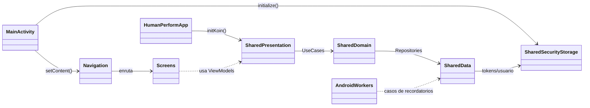
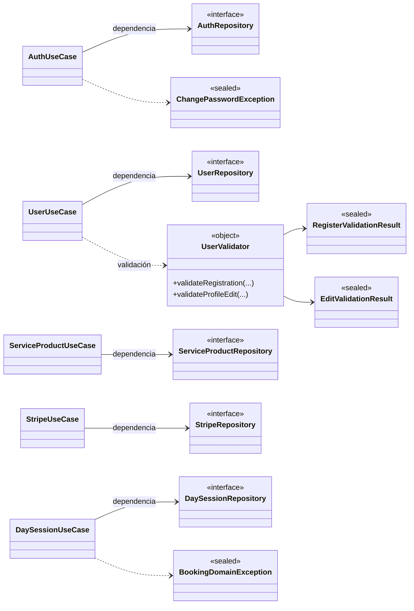
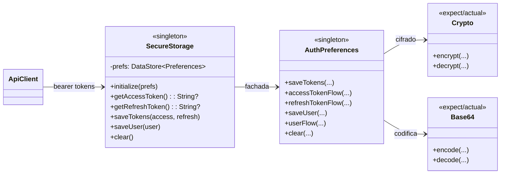
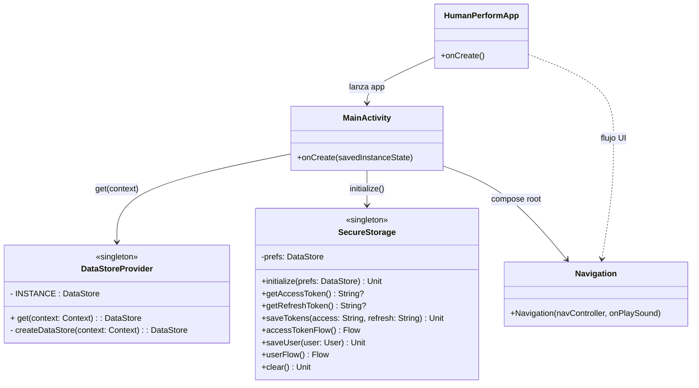

# Diagramas de clases de **todo HumanPerformApp**

A partir del resumen (clases, atributos/métodos, relaciones y separación por subsistemas), este documento modela el proyecto completo en varios diagramas para mantener legibilidad.

> **Nota**: en un sistema grande como HumanPerformApp no es recomendable un único diagrama gigante; por eso se divide por capas y subsistemas.

## 1) Vista global del proyecto (androidApp + shared KMM)

## 2) Capa shared/presentation (ViewModels, estados y casos de uso)

```mermaid
classDiagram
    direction TB

    class AuthViewModel {
      -authUseCase: AuthUseCase
      +loginState: StateFlow~LoginState~
      +registerState: StateFlow~RegisterState~
      +changePasswordState: StateFlow~ChangePasswordState~
      +resetPasswordState: StateFlow~ResetPasswordState~
      +login(email, password)
      +register(data)
      +changePassword(current, new, confirm, userId)
      +resetPassword(email)
    }

    class UserViewModel {
      -userUseCase: UserUseCase
      +userState: StateFlow~UserState~
      +updateState: StateFlow~UpdateState~
      +coachesState: StateFlow~CoachState~
      +fetchUserProfile()
      +updateUser(...)
      +getCoaches()
      +fetchUserBookings(userId)
    }

    class DaySessionViewModel {
      -daySessionUseCase: DaySessionUseCase
      +dailySessionsUiState: StateFlow~DailySessionsUiState~
      +bookingEvent: StateFlow~BookingEvent~
      +fetchAvailableSessions(productId, date)
      +makeBooking(userId, productId, serviceId, date, hour)
      +modifyBookingSession(request)
    }

    class ServiceProductViewModel {
      -serviceProductUseCase: ServiceProductUseCase
      +servicesState: StateFlow~ServiceUiState~
      +productsState: StateFlow~ServiceProductsState~
      +loadAllServices(userId)
      +loadServiceProducts(serviceId)
      +assignProductToUser(...)
      +unassignProductFromUser(...)
    }

    class StripeViewModel {
      -stripeUseCase: StripeUseCase
      +startStripeCheckout(...)
      +loadPaymentMethods()
      +createOrGetCustomer()
      +createRefund(...)
      +startStripeSubscription(...)
      +cancelSubscription(...)
    }

    class UserStatsViewModel {
      -userUseCase: UserUseCase
      +userStatsState: StateFlow~UserStatsState~
      +loadUserStats(customerId)
    }

    class AuthUseCase
    class UserUseCase
    class DaySessionUseCase
    class ServiceProductUseCase
    class StripeUseCase

    AuthViewModel --> AuthUseCase
    UserViewModel --> UserUseCase
    DaySessionViewModel --> DaySessionUseCase
    ServiceProductViewModel --> ServiceProductUseCase
    StripeViewModel --> StripeUseCase
    UserStatsViewModel --> UserUseCase

    class LoginState
    class RegisterState
    class ChangePasswordState
    class ResetPasswordState
    class DailySessionsUiState
    class BookingEvent
    class ServiceUiState
    class ServiceProductsState
    class UserStatsState

    AuthViewModel --> LoginState
    AuthViewModel --> RegisterState
    AuthViewModel --> ChangePasswordState
    AuthViewModel --> ResetPasswordState
    DaySessionViewModel --> DailySessionsUiState
    DaySessionViewModel --> BookingEvent
    ServiceProductViewModel --> ServiceUiState
    ServiceProductViewModel --> ServiceProductsState
    UserStatsViewModel --> UserStatsState
```

## 3) Capa shared/domain (use cases, repositorios y reglas)

## 4) Capa shared/data (implementaciones, cliente HTTP y modelos)

```mermaid
classDiagram
    direction TB

    class ApiClient {
      <<singleton>>
      +authClient: HttpClient
      +apiClient: HttpClient
      +baseUrl: String
      +logoutEvents: MutableSharedFlow~Unit~
    }

    class AuthRepositoryImpl {
      <<object>>
    }
    class UserRepositoryImpl {
      <<object>>
    }
    class DaySessionRepositoryImpl {
      <<object>>
    }
    class ServiceProductRepositoryImpl {
      <<object>>
    }
    class StripeRepositoryImpl {
      <<object>>
    }

    class AuthRepository {
      <<interface>>
    }
    class UserRepository {
      <<interface>>
    }
    class DaySessionRepository {
      <<interface>>
    }
    class ServiceProductRepository {
      <<interface>>
    }
    class StripeRepository {
      <<interface>>
    }

    AuthRepositoryImpl ..|> AuthRepository
    UserRepositoryImpl ..|> UserRepository
    DaySessionRepositoryImpl ..|> DaySessionRepository
    ServiceProductRepositoryImpl ..|> ServiceProductRepository
    StripeRepositoryImpl ..|> StripeRepository

    AuthRepositoryImpl --> ApiClient : HTTP
    UserRepositoryImpl --> ApiClient : HTTP
    DaySessionRepositoryImpl --> ApiClient : HTTP
    ServiceProductRepositoryImpl --> ApiClient : HTTP
    StripeRepositoryImpl --> ApiClient : HTTP

    class User {
      +id: Int
      +fullName: String
      +email: String
    }
    class Product
    class SimpleService
    class DaySession
    class BookingRequest
    class ReserveResponse
    class Coupon
    class StripePaymentMethod
    class TransactionDto

    AuthRepositoryImpl ..> User
    ServiceProductRepositoryImpl ..> Product
    ServiceProductRepositoryImpl ..> SimpleService
    DaySessionRepositoryImpl ..> DaySession
    DaySessionRepositoryImpl ..> BookingRequest
    DaySessionRepositoryImpl ..> ReserveResponse
    UserRepositoryImpl ..> Coupon
    StripeRepositoryImpl ..> StripePaymentMethod
    StripeRepositoryImpl ..> TransactionDto
```

## 5) Seguridad y almacenamiento (Facade + Strategy KMM)

## 6) Capa androidApp (arranque y navegación)

## 7) Cobertura del proyecto y lectura sugerida

Para representar **todo HumanPerformApp**, estos diagramas cubren:

- módulo Android (`app`, navegación, workers)
- módulo shared/presentation (ViewModels y estados)
- módulo shared/domain (casos de uso, repositorios y validaciones)
- módulo shared/data (implementaciones y modelos principales)
- seguridad/almacenamiento multiplataforma

Si necesitas, en un siguiente paso puedo generar una versión más granular por feature (`auth`, `calendar/booking`, `products`, `payments/stripe`, `profile`) con trazabilidad clase por clase.
