# Diagramas de secuencia (Mermaid)

> Se listan los flujos principales del proyecto **exceptuando** el proceso de autenticación con JWT.

## 1) Carga de perfil de usuario

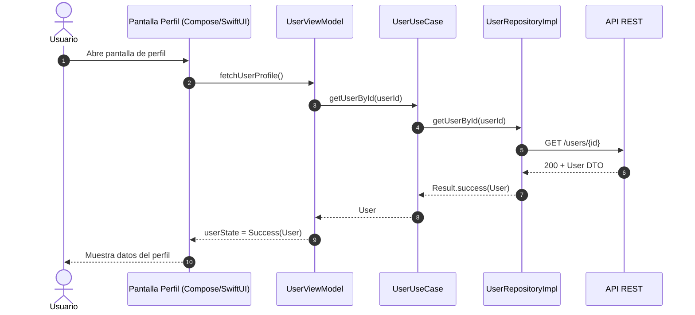

## 2) Actualización de perfil con foto

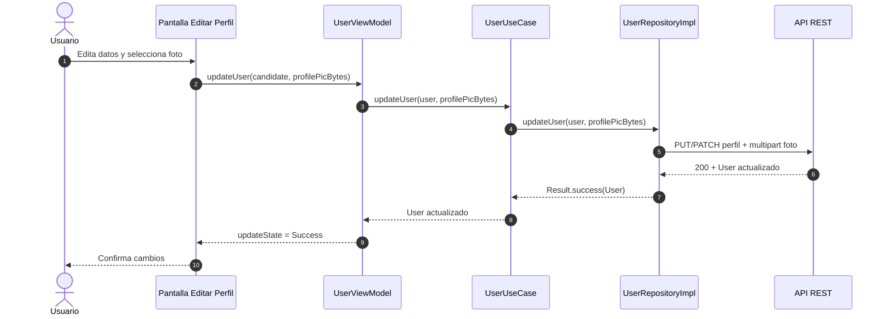

## 3) Consulta de sesiones disponibles

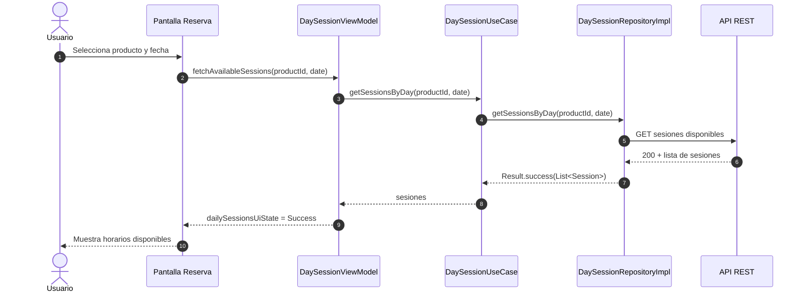

## 4) Reserva de sesión

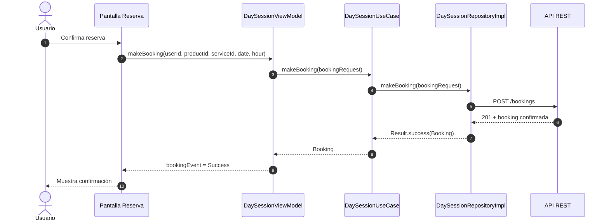

## 5) Compra/Asignación de producto (checkout Stripe)

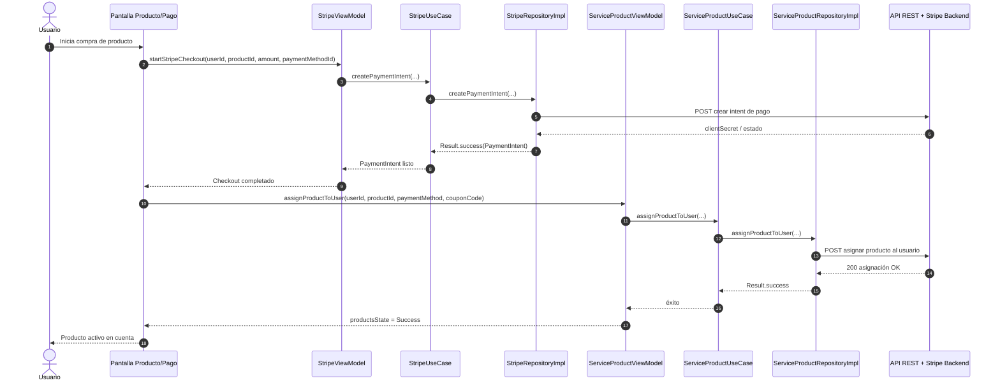

## 6) Carga de métodos de pago guardados

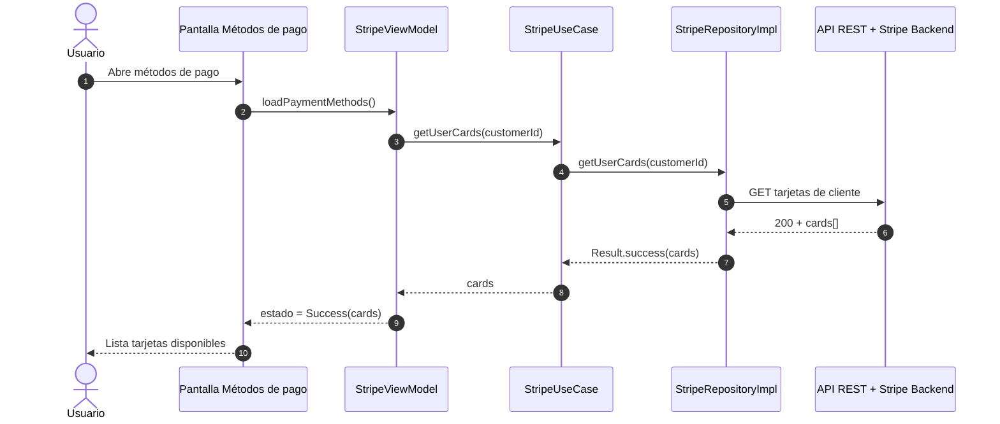

## 7) Reprogramación de una reserva

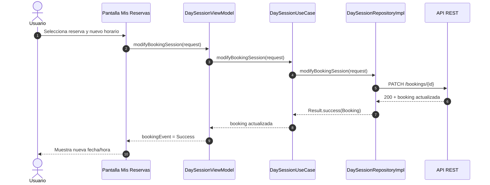

## 8) Carga del historial de reservas del usuario

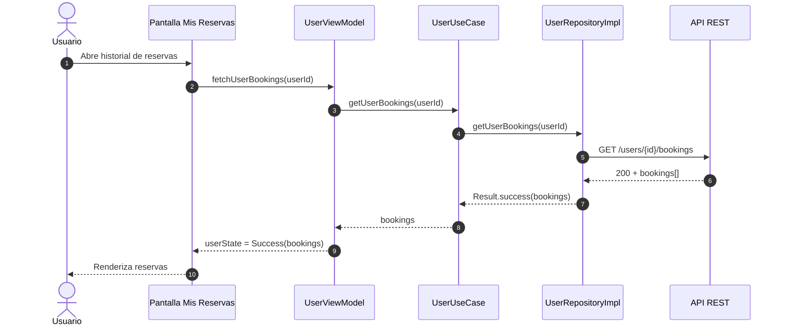

## 9) Cancelación de reserva

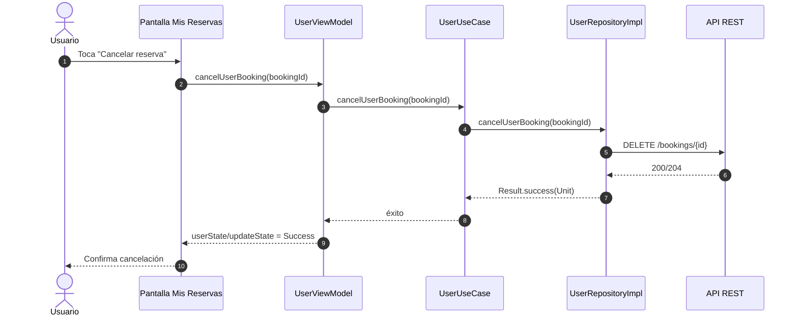

## 10) Marcar entrenador como favorito

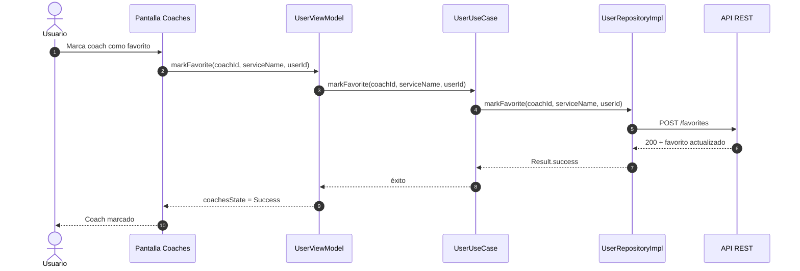

## 11) Aplicar cupón a usuario

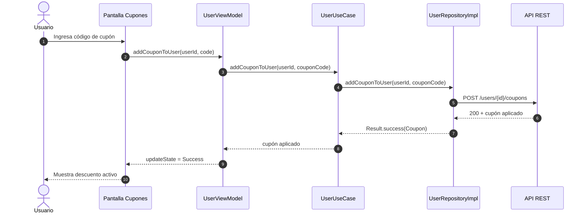

## 12) Consulta de saldo y transacciones e-wallet

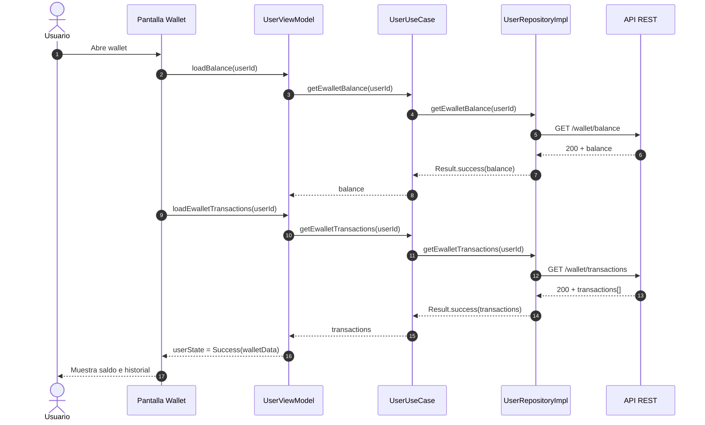
